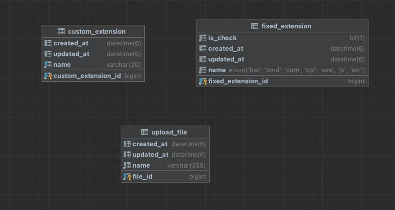
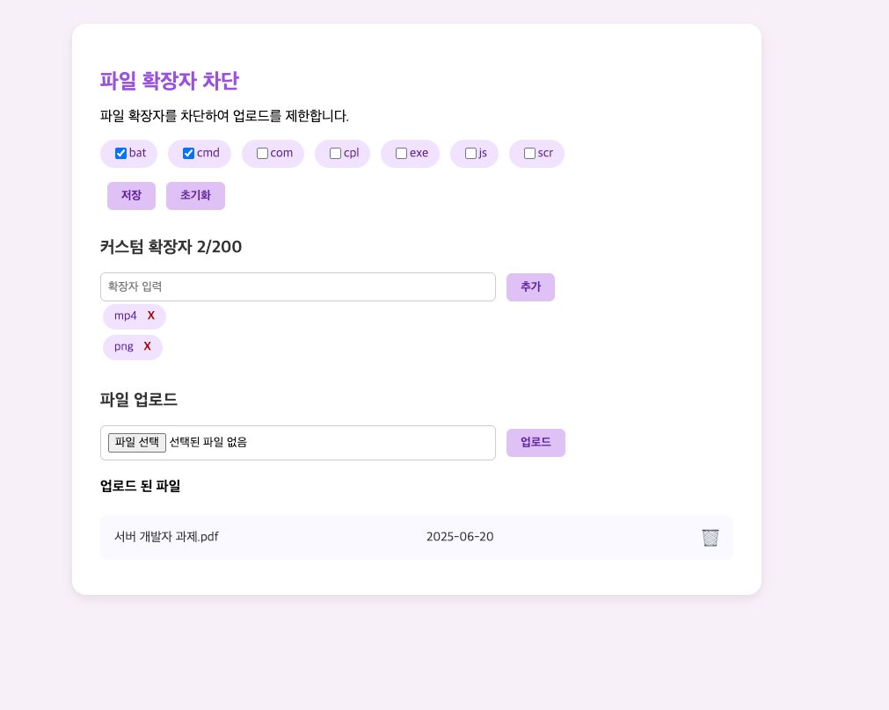

# Extension Blocking

# 기능 요구사항
어떤 파일들은 첨부시 보안에 문제가 될 수 있습니다. 특히 exe, sh 등의 실행파일이 존재할 경우 서버에 올려서 실행이 될 수 있는 위험이 있어 파일 확장자 차단을 하게 되었습니다.

## 고정 확장자 관리
- 자주 차단하는 고정 확장자 목록 제공
- 초기 상태는 모두 `unChecked`
- 체크/해제 상태는 DB에 저장되어 새로고침 후에도 유지
- 커스텀 확장자와 분리 표시

## 커스텀 확장자 관리
- 최대 20자 이하의 확장자를 입력하여 추가
- 최대 200개까지 추가 가능
- 추가/삭제 상태는 DB에 저장되어 새로고침 후에도 유지
- 삭제 시 DB에서도 제거

---

## 이외에 고려한 사항
### 커스텀 확장자 입력시 `.` , 공백 제거 및 대문자로 처리 후 저장 (`. Exe` → `EXE`)
- `.` , 대소문자 등 입력 방식에 따라 중복된 확장자가 발생할 수 있는 위험을 제거하기 위해 추가하였습니다.
### 커스텀 확장자 입력시 영어 및 숫자 이외의 문자 차단 및 예외 발생
- 영어 및 숫자 이외에 특수문자 등을 차단하여 불필요한 확장자는 제외하고자 하였습니다.
###  고정 확장자와 커스텀 확장자의 이름이 중복되지 않도록 검증 후 저장
- 커스텀 확장자 중복 여부는 DB를 기준으로 처리
- 고정 확장자 중복 여부는 (`FixedExtensionType` Enum 클래스) 기반으로 처리
- 고정 확장자에 존재하는 확장자 혹은 커스텀 확장자에 중복된 확장자가 발생하지 않도록 하고자 하였습니다.
### 고정 확장자 초기화 기능 제공 (기존 체크 항목 일괄 해제)
- 고정 확장자 체크 해제 기능이 존재하지만, 일괄적으로 해제하기 위해 기능을 추가하였습니다.
### 업로드 파일 목록 확인 및 삭제 기능
- 어떤 파일을 업로드 하였는지 확인할 수 있도록 기능을 추가하였습니다. 
### 성공/실패 여부 상관 없이 결과 alert 출력 (실패시 실패 케이스별 Exception을 통해 실패 사유 출력)
- 성공/실패 여부 상관 없이 사용자가 행위의 결과를 알 수 있도록 문구를 추가하였습니다.

---

## 구현 사항

### 프로젝트 구조 및 아키텍처

- **Layered Architecture (Controller → Service → Validator → Repository)**

  각 계층을 명확히 분리하여 역할에 따라 책임을 나누고 테스트 용이성을 높였습니다.

- **도메인 중심 설계**
    - `Extension` , `UploadFile` 핵심 도메인 중심으로 구성
    - `DTO`, `Mapper`, `Exception` 클래스 등을 통해 계층 간 분리와 검증 책임 분산
- **Validation 책임 분리**
    - `ExtensionValidator` 클래스를 별도로 두어 검증 로직 집중 관리
    - `커스텀 확장자 수 제한`, `형식 제한`, `중복 방지` 등을 Validator 단에서 일괄 관리
- **DTO는 Java의 `record`를 사용하여 설계**

### 테스트 코드

- **단위 테스트** (Mockito + JUnit5)
    - `Service`, `Validator`, `Mapper` 모두에 대해 테스트 코드 작성
    - 예외 케이스에 대한 검증 포함 (중복, 포맷 오류, 길이 초과, 고정 확장자 충돌 등)
- **API 테스트** (`@WebMvcTest + MockMvc`)
    - 요청/응답 구조와 상태 코드 검증
    - 비즈니스 예외 발생 시 알맞은 메시지가 내려오는지 확인

### 배포

- **GithubActions 및 Docker 기반 배포 자동화**
    - `main` 브랜치 푸시 시 GitHub Actions에서 자동으로 Docker 이미지 빌드 및 EC2 배포
    - `Dockerfile`과 `docker-compose.yml` 으로 구성

### 기타 고려사항

- Swagger 적용 : `/swagger-ui.html` 경로로 API 문서 자동화
- 커스텀 예외 생성 : `RuntimeException` 을 상속하는 `ApplicationException` 기반의 커스텀 예외를 생성하여 각 상황별 예외 메시지를 전달할 수 있도록 설계
- 예외 메시지 Enum 관리 : 사용자에게 일관된 메시지를 전달하도록 설계
- 전역 예외 처리 : `RestControllerAdvice` 를 활용하여 코드 전역에서 발생하는 예외 응답에 대한 통일성을 보장

---

## 개발 환경 및 기술 스택
- **Back-End**: Java 17, Spring Boot 3.5.0, Spring Data JPA
- **Front-End**: Thymeleaf, jQuery
- **Database**: MySQL
- **테스트**: JUnit5, BDDMockito
- **API 문서화**: Springdoc OpenAPI (Swagger UI)
- **빌드 툴**: Gradle
- **인프라** : AWS EC2, AWS RDS, Docker Hub, Docker-Compose, Github Actions

---

## API 명세서

### 고정 확장자 관련

| Method | Endpoint | 설명 | 요청 본문 / 파라미터 | 응답 코드 |
| --- | --- | --- | --- | --- |
| `POST` | `/api/fixed-extensions` | 고정 확장자 상태 변경 | `{ "checkedIds": [1, 2] }` | 200 OK |
| `POST` | `/api/fixed-extensions/reset` | 고정 확장자 전체 초기화 | 없음 | 200 OK |

### 커스텀 확장자 관련

| Method | Endpoint | 설명 | 요청 본문 | 응답 코드 |
| --- | --- | --- | --- | --- |
| `POST` | `/api/custom-extensions` | 커스텀 확장자 추가 | `{ "name": "exe" }` | 200 OK |
| `DELETE` | `/api/custom-extensions/{id}` | 커스텀 확장자 삭제 | Path Variable (`id`) | 200 OK |

### 파일 업로드 관련

| Method | Endpoint | 설명 | 요청 내용 | 응답 코드  |
| --- | --- | --- | --- |--------|
| `POST` | `/api/file` | 파일 업로드 | Multipart Form (`file`) | 200 OK |
| `DELETE` | `/api/file/{id}` | 업로드 파일 삭제 | Path Variable (`id`) | 200 OK |

---

## 예외 메시지 목록

### 커스텀 확장자 관련

| 예외 타입 | 메시지 |
| --- | --- |
| `ExtensionLengthExceedException` | 최대 20자 까지 가능합니다. |
| `InvalidExtensionFormatException` | 확장자는 알파벳과 숫자만 입력 가능합니다. |
| `CustomExtensionLimitExceedException` | 최대 200개의 확장자만 등록할 수 있습니다. |
| `CustomExtensionAlreadyException` | 이미 등록된 확장자입니다. |
| `CustomExtensionConflictWithFixedException` | 고정 확장자와 중복될 수 없습니다. |

### 업로드 파일 관련

| 예외 타입 | 메시지 |
| --- | --- |
| `BlockedExtensionException` | 해당 확장자는 차단되어 업로드할 수 없습니다. |

> 모든 메시지는 ExtensionExceptionMessage, UploadFileExceptionMessage enum으로 관리됩니다.
>

## ERD

## 결과물

